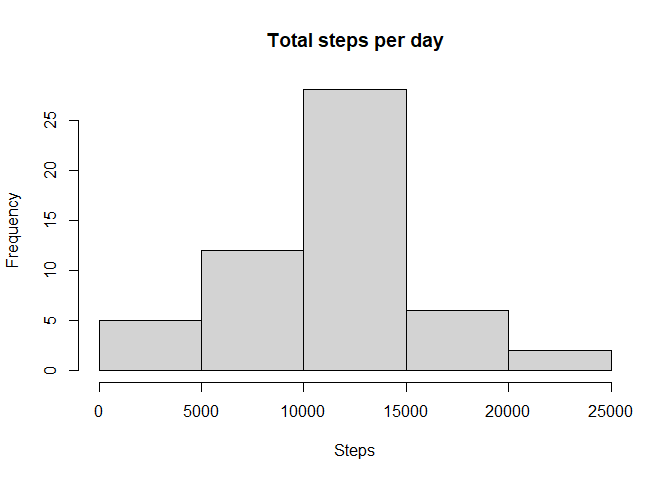
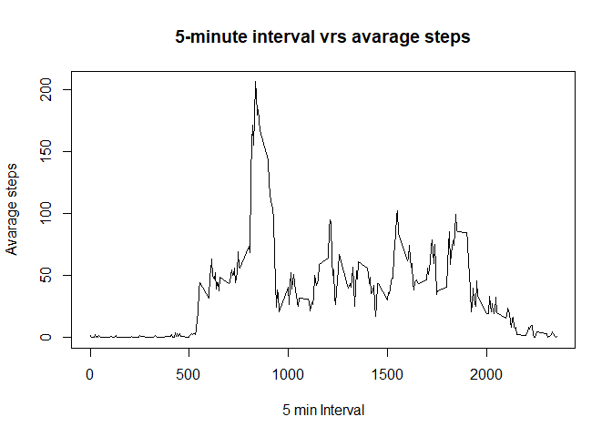
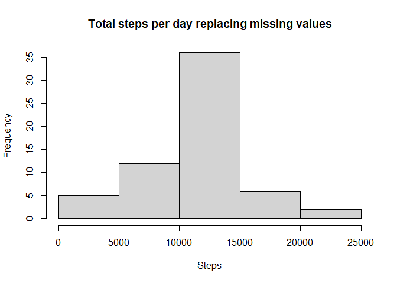
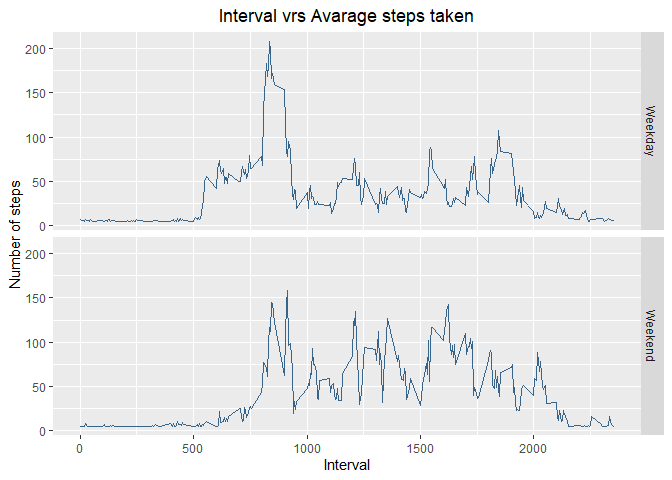

## Course Project 1

*Review criteria*

1. Valid GitHub URL
2. At least one commit beyond the original fork
3. Valid SHA-1
4. SHA-1 corresponds to a specific commit

*Commit containing full submission*

1. Code for reading in the dataset and/or processing the data
2. Histogram of the total number of steps taken each day
3. Mean and median number of steps taken each day
4. Time series plot of the average number of steps taken
5. The 5-minute interval that, on average, contains the maximum number of steps
6. Code to describe and show a strategy for imputing missing data
7. Histogram of the total number of steps taken each day after missing values are imputed
8. Panel plot comparing the average number of steps taken per 5-minute interval across weekdays and weekends
9. All of the R code needed to reproduce the results (numbers, plots, etc.) in the report

## Assigment development

## Loading and preprocessing the data

**1. Code for reading in the dataset and/or processing the data**


Reading local data in working directory.


```r
#local dir files, might be different acording to your working directory
dirfile <- "F:/R codes/Projects/RepData_PeerAssessment1/activity.zip"
unzip(dirfile,exdir="F:/R codes/Projects/RepData_PeerAssessment1")
Activity.Data <- read.csv("activity.csv")
Activity.Data$date <- as.Date(Activity.Data$date, "%Y-%m-%d")
head(Activity.Data)
```

```
##   steps       date interval
## 1    NA 2012-10-01        0
## 2    NA 2012-10-01        5
## 3    NA 2012-10-01       10
## 4    NA 2012-10-01       15
## 5    NA 2012-10-01       20
## 6    NA 2012-10-01       25
```

## What is mean total number of steps taken per day?

**2. Histogram of the total number of steps taken each day**

Total number of steps taken per day


```r
##Total number of steps taken per day
Activity.Data.group <- aggregate(steps ~ date, Activity.Data, FUN=sum)
colnames(Activity.Data.group) <- c("date", "steps")
head(Activity.Data.group)
```

```
##         date steps
## 1 2012-10-02   126
## 2 2012-10-03 11352
## 3 2012-10-04 12116
## 4 2012-10-05 13294
## 5 2012-10-06 15420
## 6 2012-10-07 11015
```
Make a histogram of the total number of steps taken each day


```r
##Make a histogram of the total number of steps taken each day
hist(Activity.Data.group$steps,main="Total steps per day", xlab="Steps")
```

<!-- -->

## What is the average daily activity pattern?

**3. Mean and median number of steps taken each day**
Calculate and report the mean and median of the total number of steps taken per day


```r
##Calculate and report the mean and median of the total number of steps taken per day
mean.median <- matrix(nrow = 1,ncol = 2)
colnames(mean.median) <- c("Mean.steps", " Median.steps")
mean.median[,1] <- mean(Activity.Data.group$steps)
mean.median[,2] <- median(Activity.Data.group$steps)
print(mean.median)
```

```
##      Mean.steps  Median.steps
## [1,]   10766.19         10765
```

The mean of the steps taken per day is 10766 and the median of the steps taken per day is 10765.

**4. Time series plot of the average number of steps taken**

What is the average daily activity pattern?

Make a time series plot (i.e. type = "l") of the 5-minute interval (x-axis) and the average number of steps taken, averaged across all days (y-axis)


```r
Activity.Data.interval.steps <- aggregate (steps ~ interval, Activity.Data, FUN = mean)
head(Activity.Data.interval.steps)
```

```
##   interval     steps
## 1        0 1.7169811
## 2        5 0.3396226
## 3       10 0.1320755
## 4       15 0.1509434
## 5       20 0.0754717
## 6       25 2.0943396
```

```r
plot(x=Activity.Data.interval.steps$interval, y=Activity.Data.interval.steps$steps,type="l", 
     xlab="5 min Interval", ylab="Avarage steps", main="5-minute interval vrs avarage steps")
```

<!-- -->

**5. The 5-minute interval that, on average, contains the maximum number of steps**

Which 5-minute interval, on average across all the days in the dataset, contains the maximum number of steps?


```r
max.number.steps <- which.max(Activity.Data.interval.steps[,2])
Activity.Data.interval.steps[max.number.steps,2]
```

```
## [1] 206.1698
```

```r
Activity.Data.interval.steps[max.number.steps,1]
```

```
## [1] 835
```

The 5-minute interval which contains the maximum number of steps is: 835

The max number of steps is: 206.1698113

## Imputing missing values

**6. Code to describe and show a strategy for imputing missing data**

Imputing missing values

Note that there are a number of days/intervals where there are missing values (coded as NA). The presence of missing days may introduce bias into some calculations or summaries of the data.

1. Calculate and report the total number of missing values in the dataset (i.e. the total number of rows with NA)


```r
missingValues <- is.na(Activity.Data)
missingValues2 <- which(missingValues)
na <- which.max(missingValues2)
print(na)
```

```
## [1] 2304
```

The total number of cases in which there are missing values are: 2304

2.Devise a strategy for filling in all of the missing values in the dataset. The strategy does not need to be sophisticated. For example, you could use the mean/median for that day, or the mean for that 5-minute interval, etc.


```r
steps.mean <- mean(Activity.Data$steps, na.rm = TRUE)
```


Create a new dataset that is equal to the original dataset but with the missing data filled in.


```r
Activity.Data2 <- Activity.Data
Activity.Data2[is.na(Activity.Data2)] <- steps.mean
head(Activity.Data2)
```

```
##     steps       date interval
## 1 37.3826 2012-10-01        0
## 2 37.3826 2012-10-01        5
## 3 37.3826 2012-10-01       10
## 4 37.3826 2012-10-01       15
## 5 37.3826 2012-10-01       20
## 6 37.3826 2012-10-01       25
```

**7. Histogram of the total number of steps taken each day after missing values are imputed**

Make a histogram of the total number of steps taken each day and Calculate and report the mean and median total number of steps taken per day. Do these values differ from the estimates from the first part of the assignment? What is the impact of imputing missing data on the estimates of the total daily number of steps?


```r
Activity.Data.group2 <- aggregate(steps ~ date, Activity.Data2, FUN=sum)
head(Activity.Data.group2)
```

```
##         date    steps
## 1 2012-10-01 10766.19
## 2 2012-10-02   126.00
## 3 2012-10-03 11352.00
## 4 2012-10-04 12116.00
## 5 2012-10-05 13294.00
## 6 2012-10-06 15420.00
```

```r
hist(Activity.Data.group2$steps, main="Total steps per day replacing missing values", xlab="Steps")
```

<!-- -->

## Are there differences in activity patterns between weekdays and weekends?

**8. Panel plot comparing the average number of steps taken per 5-minute interval across weekdays and weekends**

For this part the weekdays() function may be of some help here. Use the dataset with the filled-in missing values for this part.

Create a new factor variable in the dataset with two levels – “weekday” and “weekend” indicating whether a given date is a weekday or weekend day.


```r
Activity.Data2$daytype<-ifelse(weekdays(Activity.Data2$date)=="sábado" | weekdays(Activity.Data2$date)=="domingo", "Weekend", "Weekday")
head(Activity.Data2)
```

```
##     steps       date interval daytype
## 1 37.3826 2012-10-01        0 Weekday
## 2 37.3826 2012-10-01        5 Weekday
## 3 37.3826 2012-10-01       10 Weekday
## 4 37.3826 2012-10-01       15 Weekday
## 5 37.3826 2012-10-01       20 Weekday
## 6 37.3826 2012-10-01       25 Weekday
```

Make a panel plot containing a time series plot (i.e. type = "l") of the 5-minute interval (x-axis) and the average number of steps taken, averaged across all weekday days or weekend days (y-axis). See the README file in the GitHub repository to see an example of what this plot should look like using simulated data.


```r
Activity.Data2.group3 <- aggregate(steps ~ interval+daytype, Activity.Data2, FUN=mean)
head(Activity.Data2.group3)
```

```
##   interval daytype    steps
## 1        0 Weekday 7.006569
## 2        5 Weekday 5.384347
## 3       10 Weekday 5.139902
## 4       15 Weekday 5.162124
## 5       20 Weekday 5.073235
## 6       25 Weekday 6.295458
```

```r
library(ggplot2)
ggplot(Activity.Data2.group3, aes(x=interval, y=steps))+
  geom_line(col="steelblue4")+ facet_grid(daytype~.) +
  labs(x="Interval", y="Number of steps", title="Interval vrs Avarage steps taken")+
  theme(plot.title = element_text(hjust = 0.5))
```

<!-- -->


